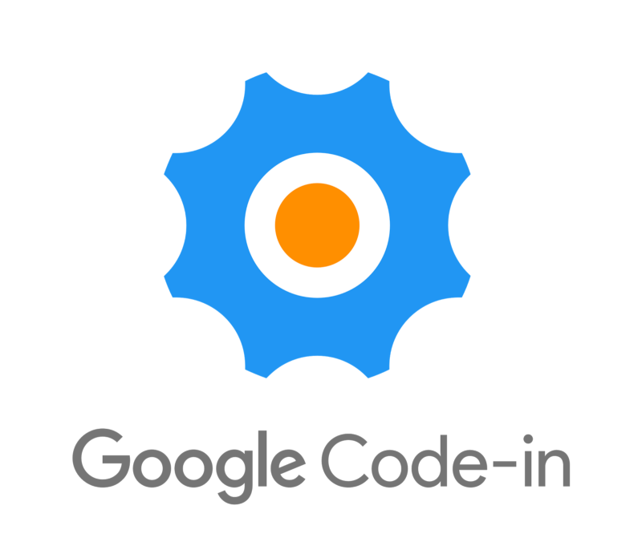
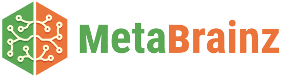
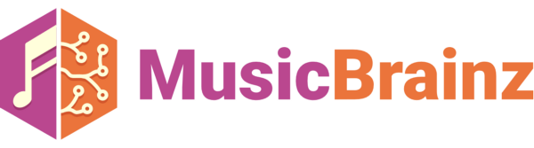
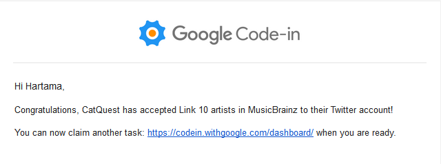
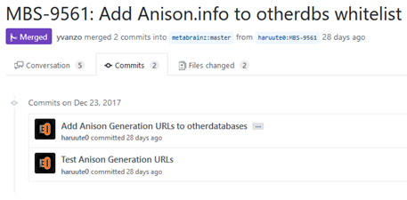

Hello, this is my experience blog post about being a Google Code-In student in 2017. I’m really happy because I can contribute with an Open Source Organization. First off, I decided to work with MetaBrainz Foundation in Google Code-In 2017.

## Introducing to MetaBrainz Foundation

Why MetaBrainz Foundation? MetaBrainz Foundation holds many *Brainz projects, they are MusicBrainz, MusicBrainz Picard, ListenBrainz, AcousticBrainz, CritiqueBrainz, BookBrainz and Cover Art Archive. With that all projects I think there will be so many tasks. And personally I like MetaBrainz Foundation because they hold many awesome projects. MetaBrainz Foundation have eight projects with many purpose.

Further I like one of their project, that is MusicBrainz. MusicBrainz for me, that is very useful project, MusicBrainz is an Open Source music encyclopedia that collect music meta data and makes it public through their website.

## My First Task with MetaBrainz Foundation

Starting my first task in MetaBrainz Foundation with “Link 10 artists in MusicBrainz to their Twitter account”. I think that will be going easy, but I’m wrong. Starting off the task without read beginner guide make me take incomplete way, yeah, I’m forgot to write edit note on each of my edits. Then mentors comment in my task instance page that I’m must provide edit note on every edits I’ve made. Yes, I have to edit my work and resubmit my task for review. Have done write edit note and resubmit the task and finally my first task on MetaBrainz have been approved.

For me, the email is so special, when I’m wrote this blog post I cannot describe how is my feeling at that time.

## Most Fun Doing Task

“Handle links to Anison Generation on MusicBrainz” is my second time doing real code task with real Pull Request in most fantastic project on Open Source Organization I’ve known, MetaBrainz. And what make it enjoyable are that’s my second task doing similar task and I’ve learn a lot how to compose good code and test function also I’ve learn how to make neat Pull Request. I’ve learn and do new command with Git like rebasing, and some fun fact I’ve broke my branch when first time rebasing my task with Picard Website so needs to make new PR.

P.S Now MBS-9561 applied to MusicBrainz website and this is the changelog.

> That’s awesome learn process!

Back again, this is most fun task so there only one answer, but allowing me to mention other superb I’ve done. I’m done doing “Create a vector drawing that visually explains differences between Release Group from Release, Track from Recording, and Recording from Work” which is also fun to do.

<blockquote class="twitter-tweet" data-lang="en">
Do you always get confused with tracks and recordings and works and releases and release groups? You&#39;re definitely not alone! Our Google Code-in student @haruute (Hartama) made these so that you can remember what is what :) - reo <a href="https://t.co/XLNTjLgVFV">pic.twitter.com/XLNTjLgVFV</a>
&mdash; MusicBrainz (@MusicBrainz) <a href="https://twitter.com/MusicBrainz/status/951038058375340032">January 10, 2018</a></blockquote>

And why I’m proud to do this, because now it is posted on MusicBrainz twitter account.

## What are I’ve learn from this year?

Many of things I’ve learn trough this year, come from my personal experience or mentor and other students talk.

* Be sure to read the docs, read it always before starting doing something.
* Write clean commit messages.
* Helping others.
* Re-basing a forked repository.
* Amending a commit that I’ve made.
* Be sure to join the community, many people there, I’m not alone.
* Quality over quantity, clear, don’t be rushed to do something. Always make sure what you do is meet the requirements.
* RegEx, little bit more technical, really, I’ve learn RegEx in Javascript for first time I think.

## Challenges

1. I think rest of the mentors and students have challenging this, Time Zone, because Google Code-In is a worldwide event so many people working on came around the world. For me, when Google Code-In starts it bring more opportunities. Christmas and New Year holidays supports me to catch the most user active time.
2. Introduce my classmate, what actually is Google Code-In. Usually when first day after holidays our class have a habit to share what have we do during holidays.
3. Personally, introduce MetaBrainz Foundation more to other Indonesian students to working together.
4. Learn new things such as Code, Issue Tracker, IRC and many more.

## Conclusion

I really enjoyed my time working on Google Code-In this year. Hope it didn’t end and I could more contribute with MetaBrainz Foundation. Really have an amazing experience with this, interact with many people.

For Future, I will be more Quality over Quantity and more loves Open Source Software. I think now I’m on the right way :D

Thank You!— Hartama

Imported from [Medium](https://medium.com/@haruute/google-code-in-experience-with-metabrainz-foundation-997ca758e076)